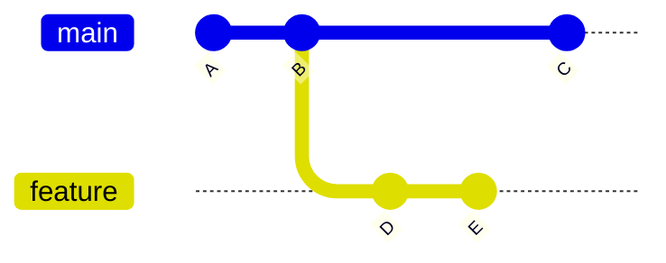
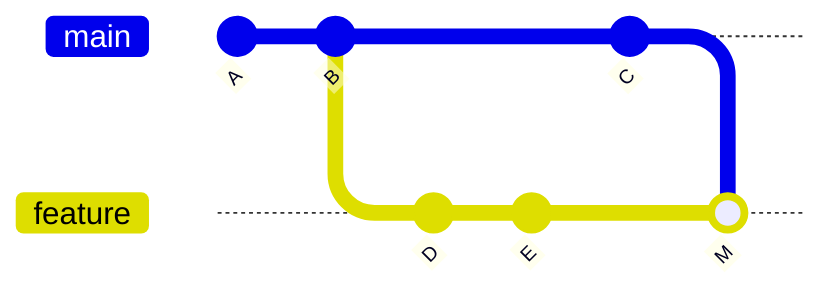
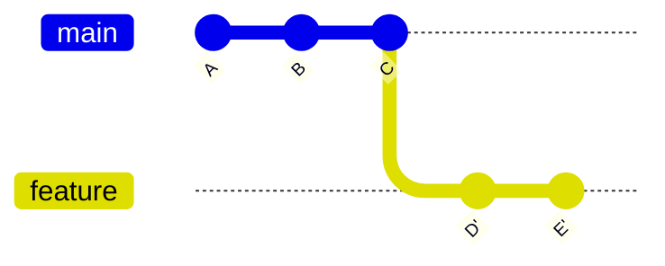

> [Git для самых маленьких. От первой команды до настройки SSH](https://habr.com/ru/articles/891050/)


# Базовые команды:

##### Инициализация и клон
Создаёт новый репозиторий в текущей папке:
```bash
git init
```

Копирует существующий удалённый репозиторий на ваш компьютер:
```bash
git clone https://github.com/user/project.git 

git clone git@github.com:user/project.git
```

##### Работа с файлами:
Показывает текущее состояние репозитория: какие файлы изменены, добавлены, неотслеживаемы и т.д. :
```bash
git status
```

Добавляет файлы в **индекс (staging area)** для последующего коммита:
```bash
git add index.html
git add .          # добавить все изменения
```

Удаляет файл из репозитория и из рабочего каталога:
```bash
git rm old_file.txt
```

##### Коммиты
Фиксирует изменения, добавленные в индекс:
```bash
git commit -m "Добавил новую страницу index.html"
```

##### Просмотр истории
Показывает историю коммитов:
```bash
git log
git log --oneline  # короткий формат
```

Показывает различия между версиями файлов:
```bash
git diff            # изменения до индексации
git diff --staged   # изменения, добавленные в индекс
```

##### Ветки
Показывает список веток или создаёт новую:
```bash
git branch                # список веток
git branch new-feature    # создать ветку
```

Переключается между ветками:
```bash
git checkout main
git checkout new-feature
```

Объединяет указанную ветку с текущей:
```bash
git merge new-feature
```

##### Работа с удалённым репозиторием
Добавляет, удаляет или показывает подключённые репозитории:
```bash
git remote -v                   # показать все подключения
git remote add origin https://github.com/user/project.git
```

Отправляет коммиты в удалённый репозиторий:
```bash
git push origin main
```

Загружает и объединяет изменения из удалённого репозитория:
```bash
git pull origin main
```

Получает обновления из удалённого репозитория без автоматического слияния:
```bash
git fetch origin
```

##### Отмена изменений
Отменяет добавление файлов в индекс или возвращает репозиторий к предыдущему коммиту.
```bash
git reset HEAD file.txt    # убрать файл из индекса
git reset --hard HEAD~1    # откатить на один коммит назад
```

Отменяет изменения в рабочей копии файла:
```bash
git checkout -- index.html
```


# **`rebase`** и **`merge`**
**`git rebase`** и **`git merge`** — это два способа объединить изменения из одной ветки в другую.

`rebase` удобно использовать когда хочешь обновить локальную ветку .

### Пример использования:
Исходная ситуация (до объединения):


После `git merge main` (слияние):

После `git rebase main` (переписывание истории):


### Сравнение:

| Критерий                     | `git merge` | `git rebase` |
| ---------------------------- | ----------- | ------------ |
| Изменяет историю             | ❌ Нет       | ✅ Да         |
| Добавляет merge-коммит       | ✅ Да        | ❌ Нет        |
| История линейная             | ❌ Нет       | ✅ Да         |
| Безопасен для общих веток    | ✅ Да        | ⚠️ Нет       |
| Удобен для локальной чистоты | ⚠️ Средне   | ✅ Отлично    |
|                              |             |              |

# **Cherry-pick**
**`git cherry-pick`** — это одна из самых полезных команд в Git, когда нужно **перенести один или несколько конкретных коммитов** из одной ветки в другую, **без слияния всей ветки**.

Полезно если например нужно **перенести фикc** (например, багфикс) из одной ветки в другую
# **Hooks**
хуки позволяют **автоматизировать действия**, которые происходят при определённых событиях в репозитории

Все хуки находятся в папке `.git/hooks/` 
После инициализации репозитория (`git init`) Git автоматически создаёт эту папку  
и добавляет туда **образцы** (`.sample`):
```
.git/hooks/
├── pre-commit.sample
├── pre-push.sample
├── post-commit.sample
└── ...
```

Чтобы активировать хук, нужно удалить `.sample` из имени файла и сделать файл исполняемым :
```
chmod +x .git/hooks/pre-commit
```

Основные типы хуков:

| Хук               | Когда срабатывает                        | Для чего используется                                       |
| ----------------- | ---------------------------------------- | ----------------------------------------------------------- |
| **pre-commit**    | Перед созданием коммита                  | Проверка кода (lint, тесты, форматирование)                 |
| **commit-msg**    | После ввода сообщения коммита            | Проверка формата сообщения (например, Conventional Commits) |
| **post-commit**   | После создания коммита                   | Уведомления, логирование                                    |
| **pre-push**      | Перед `git push`                         | Проверка тестов, линтеров, сборки                           |
| **pre-rebase**    | Перед `git rebase`                       | Предотвращение ребейса определённых веток                   |
| **post-merge**    | После `git merge`                        | Автоматическая пересборка, установка зависимостей           |
| **post-checkout** | После `git checkout`                     | Переключение окружения, пересоздание файлов                 |
| **update**        | На серверной стороне, при получении пуша | Проверка прав доступа и веток на сервере                    |

# **Submodules**

Сабмодуль — это ссылка на _другой Git-репозиторий_, который хранится **внутри твоего основного проекта**, но управляется **независимо**.

Команды:
```
git submodule add https://github.com/user/MyLibrary.git libs/MyLibrary
```
после этого в появится папка `libs/MyLibrary` с содержимым библиотеки а в корне создаётся файл `.gitmodules` — в нём Git хранит настройки сабмодулей.

> <font color="#c00000">ВАЖНО!</font>
> 1.  Если кто-то клонирует твой проект, по умолчанию сабмодули не клонируются. Нужно выполнить `git submodule init` и `git submodule update`
> 2. Основной репозиторий хранит **только ссылку на конкретный коммит** сабмодуля

Вместо Submodules можно использовать  Git Subtree, менеджеры пакетов и CI/CD pipelines

Сравнение с другими методами встраивания пакетов:

| Критерий                         | **Git Submodule**                  | **Git Subtree**                | **Package Manager**                            | **CI/CD Pipelines**                  |
| -------------------------------- | ---------------------------------- | ------------------------------ | ---------------------------------------------- | ------------------------------------ |
| **Связь с внешним репозиторием** | Хранит ссылку на конкретный коммит | Встраивает копию внешнего репо | Указывает версию в манифесте (npm, pip и т.д.) | Подтягивает код во время сборки      |
| **Обновление**                   | Вручную: `git submodule update`    | Вручную через merge/pull       | Автоматически (`npm update`, `pip install`)    | Автоматически при сборке             |
| **История коммитов**             | Отдельная, независимая             | Встраивается в историю проекта | Не хранится в проекте                          | Не хранится                          |
| **Изоляция проекта**             | Полная                             | Частичная                      | Полная                                         | Полная                               |
| **Контроль версии**              | Абсолютный (по хешу)               | По ветке или merge             | По версии пакета                               | По конфигурации pipeline             |
| **Размер репо**                  | Маленький (только ссылка)          | Увеличивается (копия кода)     | Маленький (скачивается при установке)          | Маленький (код подтягивается при CI) |
| **Нужен интернет при сборке**    | Нет                                | Нет                            | Да                                             | Да                                   |
| **Подходит для приватного кода** | ✅ Отлично                          | ✅ Хорошо                       | ⚠️ Не всегда                                   | ⚠️ Требует конфигурации доступа      |
| **Сложность использования**      | Средняя                            | Ниже                           | Минимальная                                    | Средняя/высокая                      |
