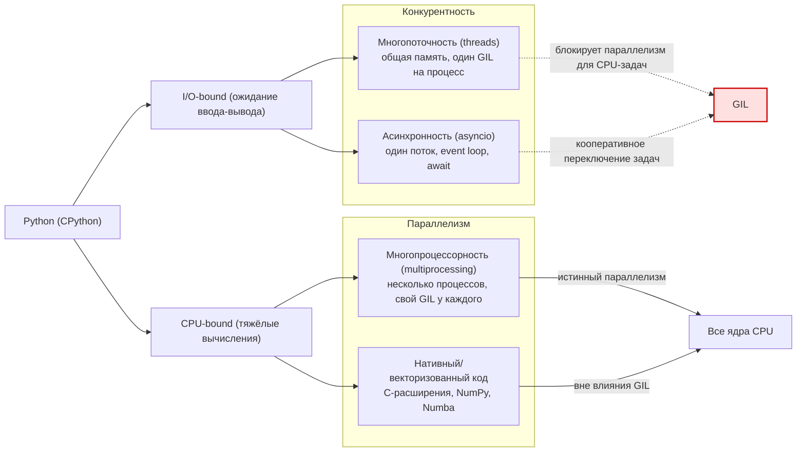

>[[Как устроен PYTHON]]
>[Объектно-ориентированное программирование. Классы и объекты](https://pythonworld.ru/osnovy/obektno-orientirovannoe-programmirovanie-obshhee-predstavlenie.html)
>[Типы данных в Python. Что нужно о них знать?](https://habr.com/ru/articles/825806/)
>[Различные вычисления, многопоточность, асинхронность и мультипроцессность в Python](https://habr.com/ru/companies/sberbank/articles/829098/)

## Общее описание 
`Python` - это объектно-ориентированный язык программирования со строгой динамической типизацией.

Под «**строгой»** подразумевается, что язык не производит неявные преобразования типов и не создаёт проблем при их случайном смешении.

Под **«динамической»** подразумевается, что типы объектов определяются в процессе исполнения программы (`runtime`).

## Типы данных 
Переменные в `Python` - это всего лишь указатели на объекты, они не содержат информации о типе.

Типы делятся на:
1. имутабельные (неизменяемые):
- None - экземпляр типа объекта `NoneType`
- bool
- int
- float
- str
- tuple - кортеж
- complex - комплексные числа
- bytes - байтовые последовательности, которые используются для работы с бинарными файлами
- frozenset

2. мутабельные (изменяемые):
- list - список (коллекции элементов )
- dict - словарь (ассоциативный массив, пары «**ключ-значение**», где каждый ключ является уникальным)
- set - множество (неупорядоченная и неиндексированная коллекция уникальных элементов)
- bytearray - массив заданных байтов
- свои костюмные классы

**Куча (**`Heap`) - это хранилище памяти в ОЗУ, которое допускает динамическое выделение памяти. Размер кучи устанавливается при запуске приложения (процесса). Данной областью управляет интерпретатор.

[[Как устроен PYTHON#Объекты]]


### `dict` и `set`

>[Python. Внутреннее устройство множеств set и словарей dict. Часть 1 из 2](https://habr.com/ru/articles/830026/)
>[Python. Внутреннее устройство множеств set и словарей dict. Часть 2 из 2](https://habr.com/ru/articles/830158/)

Ключами в `dict` и `set` могут быть только имутабельные (неизменяемые) типы данных.

Типы `dict` и `set` в Python построены на основе [хэш-таблиц](https://ru.wikipedia.org/wiki/%D0%A5%D0%B5%D1%88-%D1%82%D0%B0%D0%B1%D0%BB%D0%B8%D1%86%D0%B0).
Благодаря этому `dict` и `set` быстрее `list` при поиске данных. разрыв в производительности зависит от объёма  данных и может исчисляться тысячами

Алгоритмическая сложность поиска - [[Алгоритмы#Big O|O(1)]] ?? (если все коллизия O(n))


#### Общий принцип работы `dict`/`set`

##### создание `dict`/`set`  и Rehashing (перехеширование)
При создании `dict` и `set` мы можем не указывать значение по умолчанию. Тогда питон сам выделит место в 8 `bucket` . 

Если мы указываем значение при инициализации то питон выделяет место в 2 раза больше заданных значение но не менише 8 `bucket` ????

Питон всегда старается поддерживать заполненность памяти для `dict`/`set`  не более чем на 2/3. Как только наполненность достигает 2/3 питон вызывает rehashing (перехеширование) - создает новый `dict`/`set`  в 2 раза больше предыдущего и записывает в него содержимое  из старого `dict`/`set`
%% для `dict` полезная наполненность составляет 1/3 а не 2/3 %%
##### Описание структуры:
лучше всего описать структуру на конкретном примере `set`:

```python
workdays = {'Mon', 'Tue', 'Wed', 'Thu', 'Fri'}
```

| индекс ячейки | хэш код              | указатель на значение элемента в памяти |
| ------------- | -------------------- | --------------------------------------- |
| 0             | -1                   | —                                       |
| 1             | -1                   | —                                       |
| 2             | 2414279730484651250  | → `'Tue'`                               |
| 3             | 4199492796428269555  | → `'Mon'`                               |
| 4             | -5145319347887138165 | → `'Wed'`                               |
| 5             | 7021641685991143771  | → `'Fri'`                               |
| 6             | -1                   | —                                       |
| 7             | -1139383146578602409 | → `'Thu'`                               |
%% 
для `dict` добавляется колонка  указатель на значение ключа в памяти 

для `dict`  эта таблица должна быть разделена на 2
%%
каждая строка называется `bucket`

##### Добавление записей, коллизия хэша и индекса:

![[Блок-схема алгоритма добавления элемента в хэш-таблицу множества.png]]

Разберем алгоритм добавление элементов в `set` на конкретном примере:
```python
workdays = set()
workdays.add('Mon')
```

1. сначала высчитывается хэш с помощью встроенной функции патон которая доступна и нам:
```python
hash_value = hash('Mon') # 4199492796428269555
```
2. теперь высчитываем индекс баккета
```python
set_bucket_size = 8 # это значение по умолчанию для пустых set
idx_value = hash_value % 8 # 3
```
3. смотрим на хэшкод баккета и индексом 3:
	- Если хэшкод == -1 то баккет пуст и мы записываем данные
	-  Если хэшкод != -1 и  хэшкод != hash_value то мы столкнулись с ***коллизией индексов***
	-  Если  хэшкод == hash_value то мы проверяем совпадает ли значение в этойго баккета с  тем что мы передали. Если да то все хорошо и мы ничего не делаем, в противном случае мы столкнулись к ***коллизией хэша***

**Коллизия хэша** — это когда два разных ключа дают **одинаковое значение хэша** (или одинаковую позицию в таблице).
**Коллизия индекса** — это когда два разных ключа дают одинаковую позицию в таблице.

<font color="#c00000">чтобы решить проблему коллизии индексов питон просто обращается к следующему индексу до тех пор пока не найдет пустой баккет. такое повидение называется [**_линейным зондированием_**](https://ru.wikipedia.org/wiki/%D0%9B%D0%B8%D0%BD%D0%B5%D0%B9%D0%BD%D0%BE%D0%B5_%D0%B7%D0%BE%D0%BD%D0%B4%D0%B8%D1%80%D0%BE%D0%B2%D0%B0%D0%BD%D0%B8%D0%B5). Такое поведение может негативно сказаться на производительности поэтому питон подсчитывает количество линейных зондирований и по достижении определенного числа при последуйщих коллизий индексов ищет свободный баккет с помощью генератора псевдослучайных чисел</font>
%% подозрение на недостоверность %%


---

%%  Начиная с Python 3.3, при вычислении хэшей для объектов `str`, `bytes` и `datetime` используется случайное значение [соли](https://ru.wikipedia.org/wiki/%D0%A1%D0%BE%D0%BB%D1%8C_\(%D0%BA%D1%80%D0%B8%D0%BF%D1%82%D0%BE%D0%B3%D1%80%D0%B0%D1%84%D0%B8%D1%8F\)), как описано в выпуске [13703-Hash collision security issue](https://bugs.python.org/issue13703). Значение соли постоянно в рамках процесса Python, но меняется между запусками интерпретатора. В PEP-456 Python 3.4 принял криптографическую функцию `SipHash` для вычисления хэшей для объектов `str` и `bytes`. Случайная соль и `SipHash` — это меры безопасности для предотвращения DoS-атак. Подробности приведены в примечании в документации к [специальному методу](https://docs.python.org/3/reference/datamodel.html#object.__hash__) `__hash__`.%%

---


#### Особенности принципа работы `dict`
TODO


## Многопоточность, асинхронность,  мультипроцессность, GIL, event loop, корутин
(`asyncio`, `await`, event loop)

выбор между многопоточность, асинхронность,  мультипроцессность зависит от рода нагрузки
Вид нагрузки:
- **CPU bound** - нагрузка на процессор при сложных расчетах
- **I/O bound** — процессор ожидает операции ввода-вывода

Основных подхода к обработке нагрузки:
- **Многопроцессность** (multiprocessing):
	- У каждого процесса своя область памяти
	- каждый процесс отдельный интерпретатор Python со своим GIL
- **Многопоточность** (threading):
	- Все потоки используют общую память
	- Нагрузка вида CPU bound обрабатывается в один поток (особенность Python)
	- Для обработки нагрузки I/O bound GIL фактически отключается и позволяет работать параллельно
- **Асинхронность** (asyncio):
	- используют конкурентные потоки, которые выполняются НЕ параллельно

Многопроцессность  имеет смысл применять только с тяжелыми задачами так как создание каждого потока со своим интерпретатором Python  и своим GIL это ресурса затратная операция

[GIL](https://en.wikipedia.org/wiki/Global_interpreter_lock) (Global Interpreter Lock) — способ синхронизации потоков, который используется в некоторых интерпретируемых языках программирования.

гонка данныъ

 event loop


## Переменные и области видимости 
(LEGB — Local, Enclosing, Global, Built-in)
 [[Как устроен PYTHON#Пространства имен и область видимости]]


## Сортировка в Python


## Метаклассы и механизм создания классов
 
## Работа со строками и кодировками
 
%% ## Устройство структур данных (list, dict, set, tuple, deque и т. д.) %%
 
%% ## GC (Garbage Collector) 
 сборка мусора, подсчёт ссылок, `gc` модуль %%
 
%% ## GIL (Global Interpreter Lock) 
— ограничения и последствия для многопоточности %%
    


%% ## **Многопоточность и многопроцессность**
 
 - Модуль `threading`, `multiprocessing`, `concurrent.futures`
     
 - Потокобезопасность и синхронизация (`Lock`, `Event`, `Queue`) %%
     
## **Дескрипторы и протоколы данных**
 
 - `__get__`, `__set__`, `__delete__`
     
 - Реализация свойств (`property`)
     
## **Декораторы и замыкания**
 
 - Функции высшего порядка
     
 - Декораторы классов и методов
     
## **Контекстные менеджеры и протокол `with`**
 
 - `__enter__`, `__exit__`
     
 - Модуль `contextlib`
     
## **Итераторы и генераторы**
 
 - Протоколы `__iter__`, `__next__`
     
 - Генераторные выражения и ленивые вычисления
     
## **Типизация и аннотации**
 
 - `typing`, `dataclasses`, `pydantic`, `mypy`
     
 - Статическая vs. динамическая типизация
     
## **Импорт и модули**
 
 - Пакеты, пространства имён, `__init__.py`, `__all__`
     
 - Динамический импорт (`importlib`)
     
## **ООП в Python**
 
 - Наследование, MRO (Method Resolution Order)
     
 - Абстрактные классы (`abc`), миксины
     
## **Интерпретатор Python и байткод**
 
 - Модуль `dis`, стековая виртуальная машина
     
 - Различия между CPython, PyPy, Jython, IronPython
     
## **Оптимизация и профилирование**
 
 - Модули `cProfile`, `timeit`, `functools.lru_cache`
     
 - Оптимизация памяти и скорости
     
## **Работа с файловой системой и вводом-выводом**
 
 - `pathlib`, `os`, `io`, `shutil`
     
 - Буферизация, бинарный и текстовый I/O
 - [[Как устроен PYTHON#Работа с файлами]]
     
## **Обработка ошибок и исключений**
 
 - Иерархия исключений
     
 - Пользовательские исключения
     
## **Безопасность и sandboxing**
 
    - Изоляция исполнения, `eval`, `exec`, безопасность сериализации


