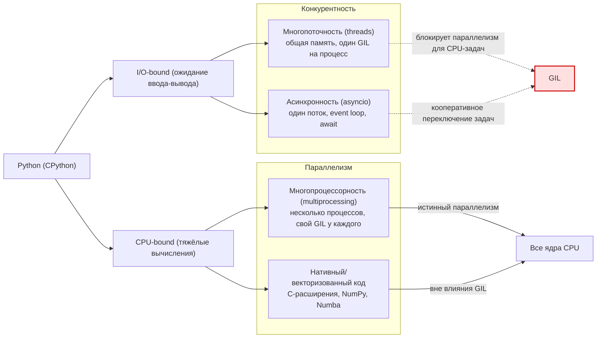

>[[Как устроен PYTHON]]
>[Объектно-ориентированное программирование. Классы и объекты](https://pythonworld.ru/osnovy/obektno-orientirovannoe-programmirovanie-obshhee-predstavlenie.html)
>[Типы данных в Python. Что нужно о них знать?](https://habr.com/ru/articles/825806/)
>[Различные вычисления, многопоточность, асинхронность и мультипроцессность в Python](https://habr.com/ru/companies/sberbank/articles/829098/)
>[Итерируемый объект, итератор и генератор](https://habr.com/ru/articles/337314/)
> [Глава 23. Итераторы и генераторы](https://senjun.ru/courses/python/chapters/python_chapter_0230/)

## Общее описание 
`Python` - это объектно-ориентированный язык программирования со строгой динамической типизацией.

Под «**строгой»** подразумевается, что язык не производит неявные преобразования типов и не создаёт проблем при их случайном смешении.

Под **«динамической»** подразумевается, что типы объектов определяются в процессе исполнения программы (`runtime`).

## Типы данных 
Переменные в `Python` - это всего лишь указатели на объекты, они не содержат информации о типе.

Типы делятся на:
1. имутабельные (неизменяемые):
- None - экземпляр типа объекта `NoneType`
- bool
- int
- float
- str
- tuple - кортеж
- complex - комплексные числа
- bytes - байтовые последовательности, которые используются для работы с бинарными файлами
- frozenset

2. мутабельные (изменяемые):
- list - список (коллекции элементов )
- dict - словарь (ассоциативный массив, пары «**ключ-значение**», где каждый ключ является уникальным)
- set - множество (неупорядоченная и неиндексированная коллекция уникальных элементов)
- bytearray - массив заданных байтов
- свои костюмные классы

**Куча (**`Heap`) - это хранилище памяти в ОЗУ, которое допускает динамическое выделение памяти. Размер кучи устанавливается при запуске приложения (процесса). Данной областью управляет интерпретатор.

[[Как устроен PYTHON#Объекты]]


### `dict` и `set`

>[Python. Внутреннее устройство множеств set и словарей dict. Часть 1 из 2](https://habr.com/ru/articles/830026/)
>[Python. Внутреннее устройство множеств set и словарей dict. Часть 2 из 2](https://habr.com/ru/articles/830158/)

Ключами в `dict` и `set` могут быть только имутабельные (неизменяемые) типы данных.

Типы `dict` и `set` в Python построены на основе [хэш-таблиц](https://ru.wikipedia.org/wiki/%D0%A5%D0%B5%D1%88-%D1%82%D0%B0%D0%B1%D0%BB%D0%B8%D1%86%D0%B0).
Благодаря этому `dict` и `set` быстрее `list` при поиске данных. разрыв в производительности зависит от объёма  данных и может исчисляться тысячами

Алгоритмическая сложность поиска - [[Алгоритмы#Big O|O(1)]] ?? (если все коллизия O(n))


#### Общий принцип работы `dict`/`set`

##### создание `dict`/`set`  и Rehashing (перехеширование)
При создании `dict` и `set` мы можем не указывать значение по умолчанию. Тогда питон сам выделит место в 8 `bucket` . 

Если мы указываем значение при инициализации то питон выделяет место в 2 раза больше заданных значение но не менише 8 `bucket` ????

Питон всегда старается поддерживать заполненность памяти для `dict`/`set`  не более чем на 2/3. Как только наполненность достигает 2/3 питон вызывает rehashing (перехеширование) - создает новый `dict`/`set`  в 2 раза больше предыдущего и записывает в него содержимое  из старого `dict`/`set`
%% для `dict` полезная наполненность составляет 1/3 а не 2/3 %%
##### Описание структуры:
лучше всего описать структуру на конкретном примере `set`:

```python
workdays = {'Mon', 'Tue', 'Wed', 'Thu', 'Fri'}
```

| индекс ячейки | хэш код              | указатель на значение элемента в памяти |
| ------------- | -------------------- | --------------------------------------- |
| 0             | -1                   | —                                       |
| 1             | -1                   | —                                       |
| 2             | 2414279730484651250  | → `'Tue'`                               |
| 3             | 4199492796428269555  | → `'Mon'`                               |
| 4             | -5145319347887138165 | → `'Wed'`                               |
| 5             | 7021641685991143771  | → `'Fri'`                               |
| 6             | -1                   | —                                       |
| 7             | -1139383146578602409 | → `'Thu'`                               |
%% 
для `dict` добавляется колонка  указатель на значение ключа в памяти 

для `dict`  эта таблица должна быть разделена на 2
%%
каждая строка называется `bucket`

##### Добавление записей, коллизия хэша и индекса:

![[Блок-схема алгоритма добавления элемента в хэш-таблицу множества.png]]

Разберем алгоритм добавление элементов в `set` на конкретном примере:
```python
workdays = set()
workdays.add('Mon')
```

1. сначала высчитывается хэш с помощью встроенной функции патон которая доступна и нам:
```python
hash_value = hash('Mon') # 4199492796428269555
```
2. теперь высчитываем индекс баккета
```python
set_bucket_size = 8 # это значение по умолчанию для пустых set
idx_value = hash_value % 8 # 3
```
3. смотрим на хэшкод баккета и индексом 3:
	- Если хэшкод == -1 то баккет пуст и мы записываем данные
	-  Если хэшкод != -1 и  хэшкод != hash_value то мы столкнулись с ***коллизией индексов***
	-  Если  хэшкод == hash_value то мы проверяем совпадает ли значение в этойго баккета с  тем что мы передали. Если да то все хорошо и мы ничего не делаем, в противном случае мы столкнулись к ***коллизией хэша***

**Коллизия хэша** — это когда два разных ключа дают **одинаковое значение хэша** (или одинаковую позицию в таблице).
**Коллизия индекса** — это когда два разных ключа дают одинаковую позицию в таблице.

<font color="#c00000">чтобы решить проблему коллизии индексов питон просто обращается к следующему индексу до тех пор пока не найдет пустой баккет. такое повидение называется [**_линейным зондированием_**](https://ru.wikipedia.org/wiki/%D0%9B%D0%B8%D0%BD%D0%B5%D0%B9%D0%BD%D0%BE%D0%B5_%D0%B7%D0%BE%D0%BD%D0%B4%D0%B8%D1%80%D0%BE%D0%B2%D0%B0%D0%BD%D0%B8%D0%B5). Такое поведение может негативно сказаться на производительности поэтому питон подсчитывает количество линейных зондирований и по достижении определенного числа при последуйщих коллизий индексов ищет свободный баккет с помощью генератора псевдослучайных чисел</font>
%% подозрение на недостоверность %%


---

%%  Начиная с Python 3.3, при вычислении хэшей для объектов `str`, `bytes` и `datetime` используется случайное значение [соли](https://ru.wikipedia.org/wiki/%D0%A1%D0%BE%D0%BB%D1%8C_\(%D0%BA%D1%80%D0%B8%D0%BF%D1%82%D0%BE%D0%B3%D1%80%D0%B0%D1%84%D0%B8%D1%8F\)), как описано в выпуске [13703-Hash collision security issue](https://bugs.python.org/issue13703). Значение соли постоянно в рамках процесса Python, но меняется между запусками интерпретатора. В PEP-456 Python 3.4 принял криптографическую функцию `SipHash` для вычисления хэшей для объектов `str` и `bytes`. Случайная соль и `SipHash` — это меры безопасности для предотвращения DoS-атак. Подробности приведены в примечании в документации к [специальному методу](https://docs.python.org/3/reference/datamodel.html#object.__hash__) `__hash__`.%%

---


#### Особенности принципа работы `dict`
TODO


## Многопоточность, асинхронность,  мультипроцессность, GIL, event loop, корутин
(`asyncio`, `await`, event loop)

выбор между многопоточность, асинхронность,  мультипроцессность зависит от рода нагрузки
Вид нагрузки:
- **CPU bound** - нагрузка на процессор при сложных расчетах
- **I/O bound** — процессор ожидает операции ввода-вывода

Основных подхода к обработке нагрузки:
- **Многопроцессность** (multiprocessing):
	- У каждого процесса своя область памяти
	- каждый процесс отдельный интерпретатор Python со своим GIL
- **Многопоточность** (threading):
	- Все потоки используют общую память
	- Нагрузка вида CPU bound обрабатывается в один поток (особенность Python)
	- Для обработки нагрузки I/O bound GIL фактически отключается и позволяет работать параллельно
- **Асинхронность** (asyncio):
	- используют конкурентные потоки, которые выполняются НЕ параллельно

Многопроцессность  имеет смысл применять только с тяжелыми задачами так как создание каждого потока со своим интерпретатором Python  и своим GIL это ресурса затратная операция

[GIL](https://en.wikipedia.org/wiki/Global_interpreter_lock) (Global Interpreter Lock) — способ синхронизации потоков, который используется в некоторых интерпретируемых языках программирования.

гонка данныъ

 event loop


## Переменные и области видимости 
(LEGB — Local, Enclosing, Global, Built-in)
 [[Как устроен PYTHON#Пространства имен и область видимости]]


## **Итераторы и генераторы**

### Итерируемый объект
Итерируемый объект - в питоне это объект который возвращает элементы по одному (обязательно реализует метод `__iter__` ) 
%% 
- при создании итерируемого  можно унаследоваться от абстрактного класса Iterable чтобы он требовал реализацию метода `__iter__()`
- если по объекту можно пройтись циклом **`for`** то это итерируемый объект 
- до Python 2.2  использовался **“старый протокол итерации”** через `__getitem__` вместо `__iter__` . **`for`** все еще его поддерживает в рамках обратной совместимости

%%

#### Итерируемые объектом в Python

| Категория                   | Примеры                                                                       | Комментарий                                               |
| --------------------------- | ----------------------------------------------------------------------------- | --------------------------------------------------------- |
| **Последовательности**      | `list`, `tuple`, `str`, `bytes`, `bytearray`, `range()`                       | Классические итерируемые объекты, поддерживают индексацию |
| **Множества**               | `set`, `frozenset`                                                            | Можно проходить в любом порядке                           |
| **Словари**                 | `dict`, `dict.keys()`, `dict.values()`, `dict.items()`                        | Все возвращают итерируемые представления                  |
| **Файлы**                   | Объекты, полученные через `open()`                                            | Читаются построчно — итерабельны                          |
| **Итераторы**               | `map`, `filter`, `zip`, `enumerate`, генераторы (`yield`, `(x for x in ...)`) | Все итераторы тоже считаются итерируемыми объектами       |
| **Пользовательские классы** | Любой объект, где реализован `__iter__()` или `__getitem__()`                 | Можно сделать итерабельным вручную                        |

### Итераторы

Итератор (`__iter__`) - специальный объект для перемещения по элементам Итерируемого объекта (обязательно реализует метод `__iter__` и `__next__`) .

- `__iter__()` — возвращает сам итератор
- `__next__()` — возвращает следующий элемент или выбрасывает `StopIteration`, когда элементы закончились.

#### Примеры

Итератор списка:
```python
num_list = [1, 2]
itr = iter(num_list)
# itr = iter(itr) # сосдает ссылку на тот же итератор в том же состоянии
print(next(itr)) # 1
print(next(itr)) # 2
print(next(itr)) # ошибка StopIteration
```

Кастомный итератор:
```python
class CustomIterator:
    def __init__(self, limit):
        self.limit = limit
        self.counter = 0

	def __iter__(self):
        return self

    def __next__(self):
        if self.counter < self.limit:
            self.counter += 1
            return self.counter * 2
        else:
            raise StopIteration

itr = CustomIterator(2)
print(next(itr)) # 2
print(next(itr)) # 4
print(next(itr)) # ошибка StopIteration
```
%% 
кастомный класс можно унаследовать от абстрактного класса `Iterator`. он по дефолту назначает 
def __iter__(self):
	return self
и требует инициализировать __next__
%%

#### Итераторы в Python

```python
# enumerate
words = ['кот', 'пёс', 'еж']
for index, word in enumerate(words):
    print(index, word)

# zip
names = ['Анна', 'Борис', 'Вика']
ages = [25, 30, 22]
for name, age in zip(names, ages):
    print(name, age)

# map
nums = [1, 2, 3, 4]
squares = map(lambda x: x**2, nums)
print(list(squares))

# filter
nums = [1, 2, 3, 4, 5, 6]
even = filter(lambda x: x % 2 == 0, nums)
print(list(even))

# iter
nums = [10, 20, 30]
it = iter(nums)
print(next(it))  # 10
print(next(it))  # 20
print(next(it))  # 30

# reversed
nums = [1, 2, 3, 4]
for n in reversed(nums):
    print(n)

```


### Генераторы
Генератор — это итератор c ленивыми вычислениями (данные генерируются/расчитываются/загружаются в память в момент обращения)
     
Синтаксически в питоне генераторы это обычные функции в которых вместо `return` используется `yield`

`yield` не завершает выполнение функции а только приостанавливает (yield означает «уступать»). Таким образом запоминается состояние, в котором функция была приостановлена

#### Примеры

Итератор списка:
```python
def generator(val):
    while val > 0:
        val -= 1
        yield val

gen_iter = generator(2)
print(next(gen_iter)) # 1
print(next(gen_iter)) # 0
print(next(gen_iter)) # ошибка StopIteration

# ИЛИ

def generator():
    yield 1
    yield 2

gen_iter = generator()
print(next(gen_iter)) # 1
print(next(gen_iter)) # 2
print(next(gen_iter)) # ошибка StopIteration

```


### Генераторные выражения

### Ленивые и жадные вычисления

Ленивые вычисления (lazy evaluation) - это подход, при котором значения не вычисляются сразу,  а только тогда когда они действительно нужны (например, при обращении к ним или при `next()` в итераторе).

**Жадные вычисления** (eager evaluation) — противоположный подход:  
все выражения вычисляются немедленно, как только программа до них доходит,  
и результаты сразу сохраняются в память.

Исходя из определений выше можно сделать следующие выводы:
 1. генераторы по природе своей ВСЕГДА ленивые но его поведение может стать "жадным":
 ```python
 def good_gen(n):
     """обычный ленивый генератор"""
    for i in range(n):
        yield i * i
        
def bad_gen(n):
     """формально ленивый генератор"""
    data = [x**2 for x in range(n)]  # всё вычислили сразу!
    for x in data:
        yield x

 ```


## Классы

### магические методы

### abc — Abstract Base Classes

### Декораторы методов класса
