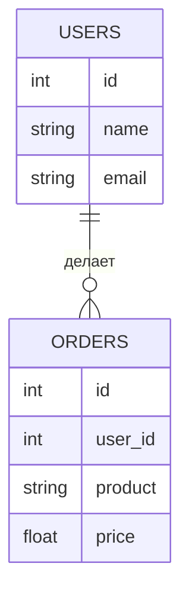
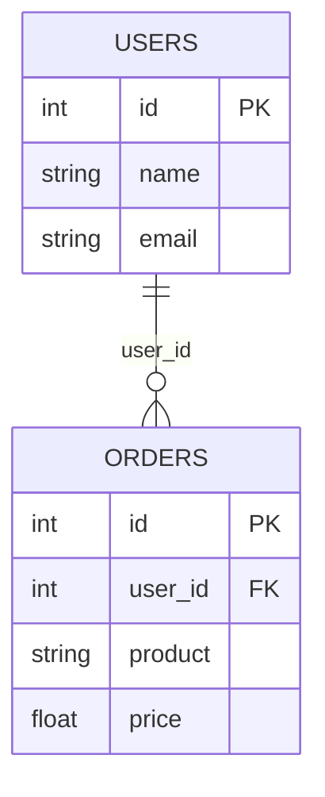

> [Как изучить SQL за ночь или шпаргалка для системного аналитика](https://habr.com/ru/articles/664550/)
> [SQL в фокусе: полное руководство. 100 ключевых вопросов с собеседований. Часть 1](https://habr.com/ru/sandbox/209900/)

## SQL теория

**SQL** (structured query language) - язык структурированных запросов, который позволяет работать с данными (найти, изменить, удалить или создать) в реляционной базе данных (БД).

 **Реляционные БД**  - это базы, где связанная информация, представленная в виде двумерных таблиц (например, Postgres, Mysql, Oracle и др.).

**СУБД** - система управления БД, программа с помощью которой можно создавать, наполнять и просматривать БД .

**ER диаграммы (Entity-Relationship model)** - показывает структуру и связи таблиц в БД. Помогает в написании SQL запросов.

В SQL выделяют основные 4 группы операторов:
- **DDL** (Data Definition Language) – работа со структурой БД,
- **DML** (Data Manipulation Language) – работы с данными таблиц,
- **DCL** (Data Control Language) – работа с правами,
- **TCL** (Transaction Control Language) – работа с транзакциями.

Структура запроса для поиска данных:

```sql
SELECT 'что' FROM 'из какой таблицы'
JOIN 'с другой таблицей'
WHERE 'условие'
ORDER BY 'сортировка'
```

```sql
SELECT 'что' FROM 'из какой таблицы'
JOIN 'с другой таблицей'
GROUP BY 'группировка'
HAVING 'условие'
```


## Примеры 

### Базовых запросов



```sql

--  Найти имена пользователей и их заказы с ценой больше 100
SELECT name, product, price
FROM USERS
JOIN ORDERS ON USERS.id = ORDERS.user_id
WHERE price > 100;
ORDER BY name; -- сортируем по имени

-- Получить топ-3 пользователей по сумме заказов
SELECT name, SUM(price) AS total_spent
FROM USERS
JOIN ORDERS ON USERS.id = ORDERS.user_id
GROUP BY name
ORDER BY total_spent DESC
LIMIT 3;

--  Найти пользователей без заказов
SELECT name
FROM USERS
LEFT JOIN ORDERS ON USERS.id = ORDERS.user_id
WHERE ORDERS.id IS NULL;

```

### SQL JOINS
![[SQL JOINS.png]]




