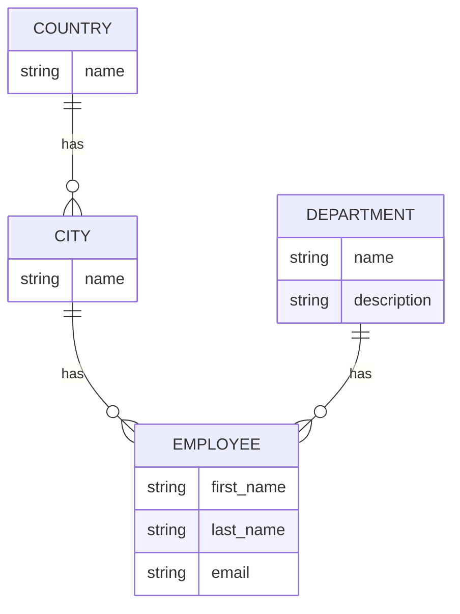

---
## Выжимка

шаблон бд:
<font color="#548dd4">City</font> >- <font color="#e36c09">Country</font>
<font color="#76923c">Employee</font> >- <font color="#548dd4">City</font>
<font color="#76923c">Employee</font> >- <font color="#b2a2c7">Department</font>



### select_related

В качестве параметров select_related принимает имена ForeignKey/OneToOne полей или related_name поля OneToOne в связанной таблице а также None.
Так как select_related является ленивым методом (он формирует правила запроса к бд а не делает сам запрос) из него можно делать интересные цепочкам

Когда не стоит использовать select_related? когда мы подгружаем с помощью него одни и теже данные. например когда загружаем список пользователей и к каждому из них хотим подгрузить его департамент. по итогу мы условно 3 департамента выгружаем так будто для каждого пользователя он уникален. в таких случаях лучше использовать prefetch_related

#### Плохой пример получения вложенных таблиц:
```python
for employee in Employee.objects.all():    
	print(employee.id, employee.first_name, employee.last_name, employee.department.name)
```
> сначала формируется запрос на получение списка сотрудников а потом запросы на получение департаментов **ПО ОДНОМУ**


#### Хороший пример получения вложенных таблиц :
```python
for employee in Employee.objects.all().select_related("department"):    
	print(employee.id, employee.first_name, employee.last_name, employee.department.name)
```

```sql
SELECT "employee_employee"."id",
"employee_employee"."first_name",
"employee_employee"."last_name",
"employee_employee"."department_id",
"employee_employee"."email",
"employee_employee"."city_id",
"employee_department"."id",
"employee_department"."name",
"employee_department"."description"
FROM "employee_employee"
INNER JOIN "employee_department" ON ("employee_employee"."department_id" = "employee_department"."id")
```


#### Примеры использования select_related:
```python
# загружаем сотрудников и его страну
Employee.objects.all().select_related("city", "city__country")
Employee.objects.all().select_related("city").select_related("city__country")
# загружаем сотрудников и его город и страну
Employee.objects.all().select_related("city__country")
```


#### Пример цепочек из select_related:
```python
employee_and_country = Employee.objects
    .select_related("city", "city__country")
    
# если вызвать employee_and_country.all() то мы получим сотрудников с их странами
    
employee_and_city = employee_and_country.select_related(None)
    .select_related("city")
    
# если вызвать employee_and_city.all() то мы обнулим .select_related("city", "city__country") который был у employee_and_country с помощью .select_related(None) и получим сотрудников с их городами
```


### prefetch_related

prefetch_related делает отдельный запрос на получение данных из каждой таблицы а потом связывает из с основными данными на уровне питона

позволяет  загружать объекты для ManyToMany полей и записи которые ссылаются на нашу таблицу через ForeignKey

можно строитьт цепочки аналогичные select_related а также очещить их через  prefetch_related(None)


#### Примеры "равноценных" записей через  prefetch_related и select_related

##### Пример 1
select_related:
```python
Employee.objects.all().select_related("city", "city__country")
```

prefetch_related:
```python
Employee.objects.all().prefetch_related("city", "city__country")
```

```sql
SELECT "employee_employee"."id",
"employee_employee"."first_name",
"employee_employee"."last_name",
"employee_employee"."department_id",
"employee_employee"."email",
"employee_employee"."city_id"
FROM "employee_employee"

SELECT "employee_city"."id",
"employee_city"."name",
"employee_city"."country_id"
FROM "employee_city"
WHERE "employee_city"."id" IN (22, 23, 25, 26, 27, 28)

SELECT "employee_country"."id",
"employee_country"."name"
FROM "employee_country"
WHERE "employee_country"."id" IN (4, 5, 6)
```

#### комбинации select_related и prefetch_related

```python
# prefetch_related выболнит 2 запроса. один для city и один country
Employee.objects.all().prefetch_related("city__country")

# prefetch_related выболнит 1 запроса на country так как уже загружен через select_related
Employee.objects.all().select_related("city").prefetch_related("city__country")

# ?????????????
Employee.objects.all().prefetch_related("city__country").select_related("city")

# ?????????????
Employee.objects.all().select_related("city").prefetch_related("city__country").select_related("city")

# ?????????????
Employee.objects.all().prefetch_related("city__country").select_related("city").prefetch_related("city__country")
```

### Prefetch
параметры Prefetch:
-  **lookup** - для поиска отношения, аналогично строке которую мы передаем в случае если не используем объект Prefetch;
- **queryset** - опциональный параметр для настройки QuerySet который будет использоваться для загрузки связанных объектов (нельзя использовать values и values_list);
- **to_attr** - опциональный параметр с помощью которого можно изменить поле в которое будут загружены связанные объекты, загруженные таким образом объекты будут собраны в список, а не объект QuerySet


## Связанные заметки
[[QuerySet]] - select_related и prefetch_related являются методами  QuerySet 

